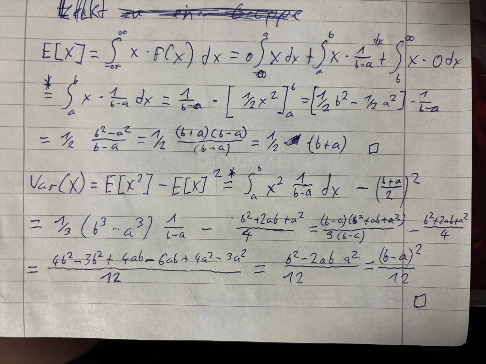
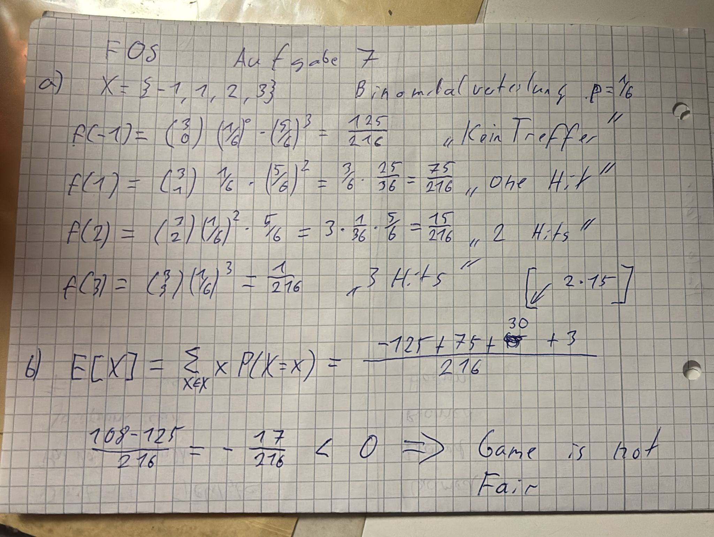
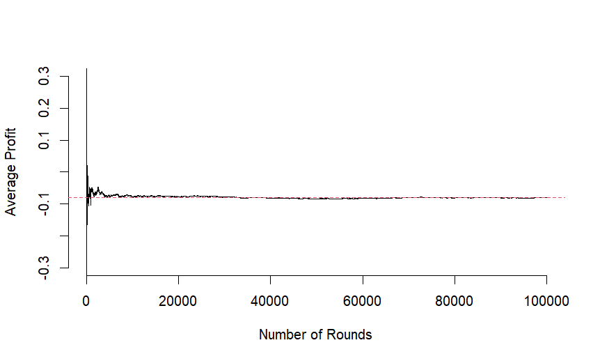

```{r setup, include=FALSE}
knitr::opts_chunk$set(echo = TRUE)
```

## Part I
### 1.
#### a)


#### b)


### 2.
**Possible family compositions:**

* $P(first \quad boy)=0.5$
* $P(first \quad girl)=0.5$
* $P(girl \cap boy) = 0.5 \cdot 0.5 = 0.25$
* $P(girl \cap girl) = 0.25$

**Having; **

* $P(boy) = P(first \quad boy \cup girl \cap boy) = 0.5 + 0.25 = 0.75$
* $P(girl) = P(first \quad girl \cup girl \cap girl) = 0.5 + 0.25 = 0.75$

**Ratio**

is 1:1
```{r}
sim <- function() {
  first_child <- sample(c(1, 0), 1, prob = c(0.5,0.5))  # 1=boy
  
  if (first_child == 1) {
    return(1)
  } else {
    second_child <- sample(c(1, 0), 1, prob = c(0.5,0.5))
    return(c(0, second_child))  
  }
}

allc <- c()
for (i in 1:100000) {
  allc <- c(allc, sim())
}

hist(allc, main = "Histogram of all children", xlab = "0 = girl  1 = boy")
```

#### % of boys is;
```{r}
sum(allc)/length(allc)
```


## Part II
### 3.


### 4.
#### a)


#### b)


#### c)


#### d) 

### 5.

#### a)

**Find:** The CDF of $Y = X⁺ = max(0, X)$

**Case 1: $y < 0$**

Since $Y = max(0, X) ≥ 0$ $\forall x$, we have $P(Y ≤ y) = 0$ for $y < 0$.

**Case 2: $y \geq 0$**

For $y \geq 0$:

- $Y ≤ y ⟺ max(0, X) \leq  y$
- This is equivalent to $X ≤ y$ (since both $X ≤ 0$ and $0 < X ≤ y$ satisfy the condition)
- Therefore: $P(Y ≤ y) = P(X ≤ y) = F_X(y)$

**Result:**

$$F_Y(y) = \begin{cases} 
0 & \text{if } y < 0 \\ 
F_X(y) & \text{if } y \geq 0 
\end{cases}$$

---

#### b)

**Find:** The CDF and PDF of Y = -X

##### CDF of Y:

$$F_Y(y) = P(Y \leq y) = P(-X \leq y)|\cdot -1$$

$$P(-X \leq y) = P(X \geq -y)$$

$$P(X \geq -y) = 1 - P(X < -y)$$

Since X is continuous, 

$$P(X < -y) = P(X ≤ -y) = F_X(-y)$$

$$F_Y(y) = 1 - F_X(-y)$$

##### PDF of Y:

We obtain the PDF by differentiating the CDF with respect to y:

$$f_Y(y) = \frac{d}{dy} F_Y(y) = \frac{d}{dy} [1 - F_X(-y)]$$

Using the chain rule:

$$f_Y(y) = -F_X'(-y) \cdot (-1) = F_X'(-y) = f_X(-y)$$

---

### 6.



## Part III
### 7.

#### a and b)




#### c)
```{r}
nloop<-10000
a<-5
Win<-rep(NA,nloop)
for (k in 1:nloop){
Dice<-sample(1:6,size=3,replace=TRUE)
Count_a<-sum(Dice==a)
Win[k]<-ifelse(Count_a==0,-1,Count_a)
}
sum(Win) ## overall
sum(Win)/nloop ## on average per game

# outcome for nloop <- 10000:
#sum(Win) = -759
#sum(Win)/nloop = -0.0759  (on average per game)

# outcome for nloop <- 100000:
#sum(Win) = -8007
#sum(Win)/nloop = -0.08007  (on average per game)

```

#### d)
Code given:
```{r}
options(scipen=999)
plot(cumsum(Win)/(1:nloop),type="l",bty="n",
ylab="Average Profit",xlab="Number of Rounds")
abline(h=-17/216,col=2,lty=2)
```

Our Code: 
```{r}
options(scipen=999)
plot(cumsum(Win)/(1:nloop),type="l",bty="n",
     ylab="Average Profit",xlab="Number of Rounds",
     ylim = c(-0.3, 0.3))
abline(h=-17/216,col=2,lty=2)
```
I changed the y axis so that it only goes from -0.3 to 0.3  because really quick it got around the expactation and this way we see the process in more detail

the plot we got:

