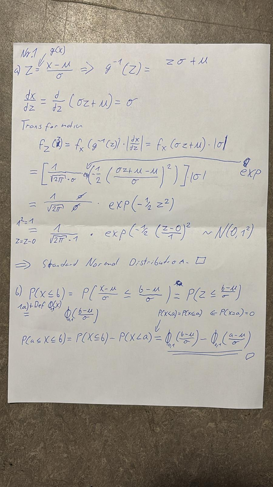
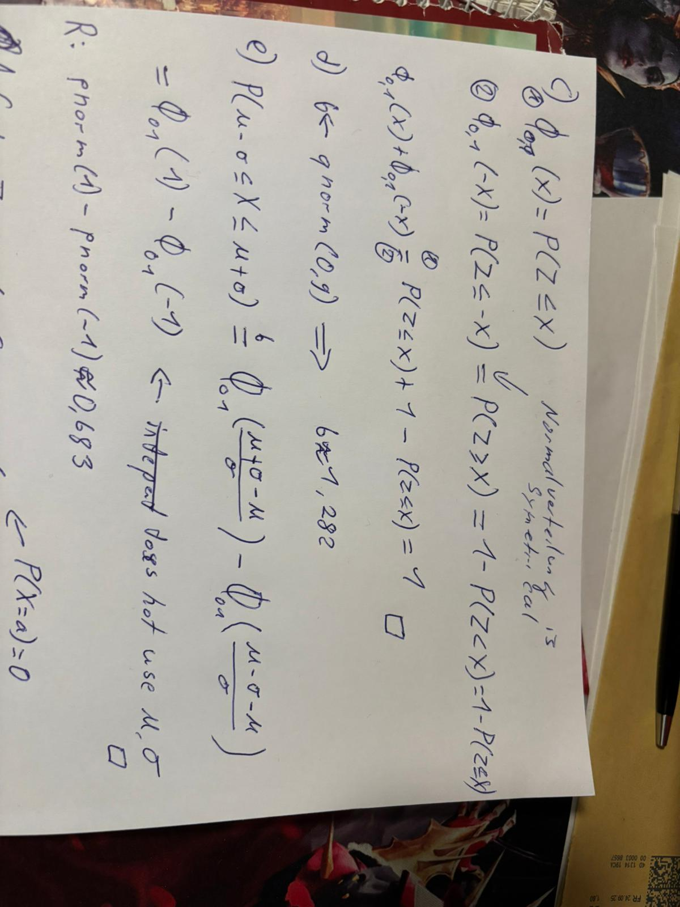
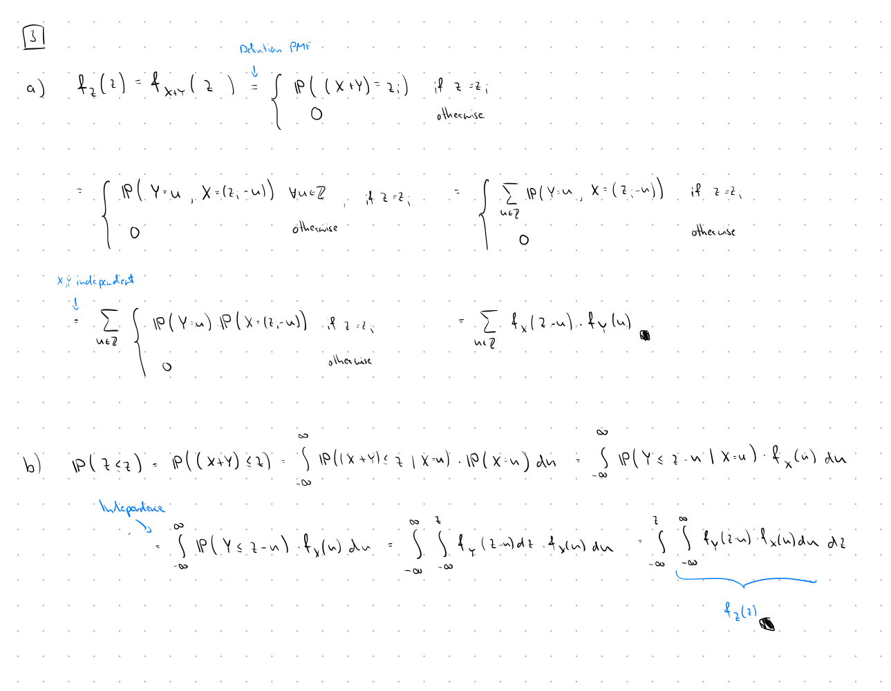

```{r setup, include=FALSE}
knitr::opts_chunk$set(echo = TRUE)
```

## Part I
### 1.
#### a and b)

#### c-e)


### f
```{r}

#f

m <- sample(-100:100, 1)

s <- sample(1:20, 1)

n <- 10000

X_samples <- rnorm(n, mean = m, sd = s)


inBoundery <- (X_samples >= m - s) & (X_samples <= m + s)


simulated_prob <- sum(inBoundery) / n

print(simulated_prob)

```

### 2.
#### a), b)


#### c)
```{r}
# set a seed for reproducibility
set.seed(420)

# ?rexp()
lambda <- 1
values_X <- rexp(n=1000, rate=lambda)
values_Y <- rexp(n=1000, rate=lambda)

# ?hist()
# ?curve()
hist(values_X, probability=TRUE, main="X density", xlab="X", ylab="density", ylim=c(0,1))
curve(dexp(x, rate=1), col="blue", add=TRUE)

# The resulting RV follows a gamma distribution with shape 1 and rate 1.
values_Z <- values_X + values_Y

hist(values_Z, probability=TRUE, main="Z density", xlab="Z", ylab="density", ylim=c(0,0.4))
curve(dgamma(x, shape=2, rate=1), col="red", add=TRUE)
```


### 3.
#### a)
#### b)

### 4.
#### a)
#### b)

### 5.
#### a)
#### b)

### 6.
#### a)
#### b)

### 7.
#### a)
#### b)

