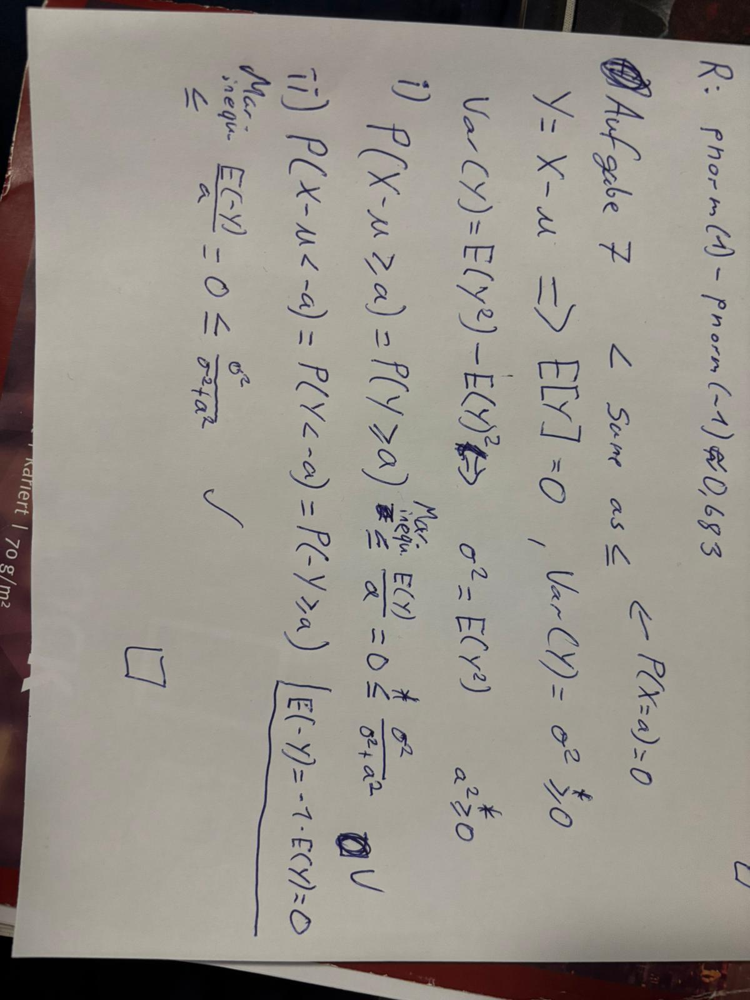

```{r setup, include=FALSE}
knitr::opts_chunk$set(echo = TRUE)
```

## Part I
### 1.
#### a and b)

#### c-e)


### f
```{r}

#f

m <- sample(-100:100, 1)

s <- sample(1:20, 1)

n <- 10000

X_samples <- rnorm(n, mean = m, sd = s)


inBoundery <- (X_samples >= m - s) & (X_samples <= m + s)


simulated_prob <- sum(inBoundery) / n

print(simulated_prob)

```

### 2.
#### a), b)


#### c)
```{r}
# set a seed for reproducibility
set.seed(420)

# ?rexp()
lambda <- 1
values_X <- rexp(n=1000, rate=lambda)
values_Y <- rexp(n=1000, rate=lambda)

# ?hist()
# ?curve()
hist(values_X, probability=TRUE, main="X density", xlab="X", ylab="density", ylim=c(0,1))
curve(dexp(x, rate=1), col="blue", add=TRUE)

# The resulting RV follows a gamma distribution with shape 1 and rate 1.
values_Z <- values_X + values_Y

hist(values_Z, probability=TRUE, main="Z density", xlab="Z", ylab="density", ylim=c(0,0.4))
curve(dgamma(x, shape=2, rate=1), col="red", add=TRUE)
```


### 3.
#### a)
#### b)

### 4.
$$P(X>t+s|X>t)=\frac{P(X>t+s\cap X>t)}{X>t} \quad (1)$$
**CDF** of the exponential distribution is $1-e^{-\lambda x}$:

$$ P(X>x) = 1 - (1-e^{-\lambda x})=e^{-\lambda x} \quad (2)$$
The denominater of (1) has to be;

$$P(X>t+s\cap X>t) = P(X>t+s)$$
since we have $>$ and $\cap$

Putting (2) in (1) gives;

$$P(X>t+s|X>t)=\frac{P(X>t+s)}{e^{-\lambda t}}=\frac{e^{-\lambda (t+s)}}{e^{-\lambda t}}=e^{-\lambda s}= P(X>s)$$


### 5.
#### a)

We use the **Poisson distribution** because:

- Events occur randomly and independently
- Constant average rate (λ = 3 per month)
- We count discrete events in a fixed time interval

**Model:** $X \sim \text{Poisson}(\lambda = 3)$


For a Poisson distribution with parameter $\lambda$:

$$\mathbb{E}[X] = \lambda = 3$$
$$\text{Var}(X) = \lambda = 3$$

---

#### b)


```{r part_b}
# P(X >= 6) = 1 - P(X <= 5)
p_geq_6 <- 1 - ppois(5, lambda = 3)
p_geq_6

```

**Result:** $P(X \geq 6) \approx$ `r round(p_geq_6, 4)`

---

#### c)

### Chebyshev's Inequality

For any random variable with mean $\mu$ and variance $\sigma^2$:

$$P(|X - \mu| \geq k) \leq \frac{\sigma^2}{k^2}$$


We have:

- $\mu = 3$
- $\sigma^2 = 3$


$$P(X \geq 6) \leq P(|X - \mu| \geq 3) \leq \frac{\sigma^2}{k^2} = \frac{3}{3^2} = \frac{3}{9} = \frac{1}{3}$$


#### Comparison

The Chebyshev bound gives us $P(X \geq 6) \leq \frac{1}{3} \approx 0.333$

From part b, we calculated the exact probability: $P(X \geq 6) \approx$ `r round(p_geq_6, 4)`

**Conclusion:** The Chebyshev bound is much looser than the exact probability, which is expected since Chebyshev's inequality is a general bound that works(both the left and right sides considered) for any distribution and only uses mean and variance information.

---

### 6.
#### Part I: $-1 \leq \rho(X,Y) \leq 1$

By definition:
$$\text{Cov}(X,Y) = \mathbb{E}[(X - \mathbb{E}(X))(Y - \mathbb{E}(Y))] = \mathbb{E}(\tilde{X} \cdot \tilde{Y})$$
$$\text{Var}(X) = \mathbb{E}[(X - \mathbb{E}(X))^2] = \mathbb{E}(\tilde{X}^2)$$
$$\text{Var}(Y) = \mathbb{E}[(Y - \mathbb{E}(Y))^2] = \mathbb{E}(\tilde{Y}^2)$$

**centered variables**

define the centered random variables:
$$\tilde{X} = X - \mathbb{E}(X), \quad \tilde{Y} = Y - \mathbb{E}(Y)$$


These have mean zero: $\mathbb{E}(\tilde{X}) = 0$ and $\mathbb{E}(\tilde{Y}) = 0$.

**Applying the Cauchy-Schwarz inequality to $\tilde{X}$ and $\tilde{Y}$:**


$$|\mathbb{E}(\tilde{X} \cdot \tilde{Y})| \leq \sqrt{\mathbb{E}(\tilde{X}^2)} \cdot \sqrt{\mathbb{E}(\tilde{Y}^2)}$$
which is;
$$|\text{Cov}(X,Y)| \leq \sqrt{\text{Var}(X)} \cdot \sqrt{\text{Var}(Y)}$$

**the bounds**

Dividing both sides by $\sqrt{\text{Var}(X) \cdot \text{Var}(Y)}$ (assuming both variances are positive):
$$\frac{|\text{Cov}(X,Y)|}{\sqrt{\text{Var}(X) \cdot \text{Var}(Y)}} \leq \frac{\sqrt{\text{Var}(X)} \cdot \sqrt{\text{Var}(Y)}}{\sqrt{\text{Var}(X)} \cdot \sqrt{\text{Var}(Y)}}=1$$

This gives us:
$$|\rho(X,Y)| \leq 1$$

Which is equivalent to:
$$-1 \leq \rho(X,Y) \leq 1$$

---

#### Part II: Equality condition $|\rho(X,Y)| = 1 \Longleftrightarrow Y = cX + d$

**Direction 1: $|\rho(X,Y)| = 1 \Rightarrow Y = cX + d$**

From the Cauchy-Schwarz inequality, equality holds if and only if there exists a constant $a \in \mathbb{R}$ such that:
$$\tilde{X} = a \tilde{Y}$$

This means:
$$X - \mathbb{E}(X) = a(Y - \mathbb{E}(Y))$$

Rearranging:
$$X = aY + [\mathbb{E}(X) - a\mathbb{E}(Y)]$$

Or equivalently (solving for $Y$):
$$Y = \frac{1}{a}X + \left[\mathbb{E}(Y) - \frac{1}{a}\mathbb{E}(X)\right]$$

Setting $c = \frac{1}{a}$ and $d = \mathbb{E}(Y) - c\mathbb{E}(X)$, we get:
$$Y = cX + d$$

**Determining the sign of $c$:**

From $\tilde{X} = a\tilde{Y}$, taking variances:
$$\text{Var}(X) = a^2 \text{Var}(Y)$$

Therefore:
$$a = \pm\sqrt{\frac{\text{Var}(X)}{\text{Var}(Y)}}$$

And:
$$c = \frac{1}{a} = \pm\sqrt{\frac{\text{Var}(Y)}{\text{Var}(X)}}$$

Now, the covariance is:
$$\text{Cov}(X,Y) = \mathbb{E}(\tilde{X} \cdot \tilde{Y}) = \mathbb{E}(a\tilde{Y} \cdot \tilde{Y}) = a\mathbb{E}(\tilde{Y}^2) = a \cdot \text{Var}(Y)$$

The correlation coefficient becomes:
$$\rho(X,Y) = \frac{a \cdot \text{Var}(Y)}{\sqrt{\text{Var}(X) \cdot \text{Var}(Y)}} = \frac{a \cdot \sqrt{\text{Var}(Y)}}{\sqrt{\text{Var}(X)}}$$

- If $a > 0$: $\rho(X,Y) = +1$ and $c = +\sqrt{\frac{\text{Var}(Y)}{\text{Var}(X)}}$
- If $a < 0$: $\rho(X,Y) = -1$ and $c = -\sqrt{\frac{\text{Var}(Y)}{\text{Var}(X)}}$


**Direction 2: $Y = cX + d \Rightarrow |\rho(X,Y)| = 1$**

Assume $Y = cX + d$ for constants $c \neq 0$ and $d$.

Then:
$$\mathbb{E}(Y) = c\mathbb{E}(X) + d$$
$$\tilde{Y} = Y - \mathbb{E}(Y)$$

$$= (cX + d) - (c\mathbb{E}(X) + d)$$

$$= cX + d - c\mathbb{E}(X) - d$$

$$= cX - c\mathbb{E}(X)$$

$$= c(X - \mathbb{E}(X))$$

$$= c\tilde{X}$$

Therefore:
$$\text{Cov}(X,Y) = \mathbb{E}(\tilde{X} \cdot \tilde{Y}) = \mathbb{E}(\tilde{X} \cdot c\tilde{X}) = c\mathbb{E}(\tilde{X}^2) = c \cdot \text{Var}(X)$$

$$\text{Var}(Y) = \mathbb{E}(\tilde{Y}^2) = c^2\mathbb{E}(\tilde{X}^2) = c^2 \cdot \text{Var}(X)$$

The correlation coefficient is:
$$\rho(X,Y) = \frac{c \cdot \text{Var}(X)}{\sqrt{\text{Var}(X) \cdot c^2 \text{Var}(X)}} = \frac{c \cdot \text{Var}(X)}{|c| \cdot \text{Var}(X)} = \frac{c}{|c|} = \text{sign}(c)$$

Therefore:

- If $c > 0$: $\rho(X,Y) = +1$
- If $c < 0$: $\rho(X,Y) = -1$

Thus, $|\rho(X,Y)| = 1$.


---

### 7.
#### a and b)



