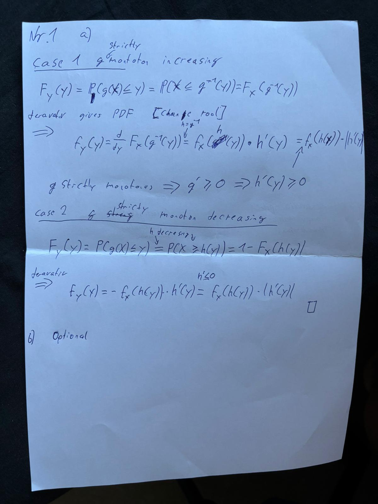
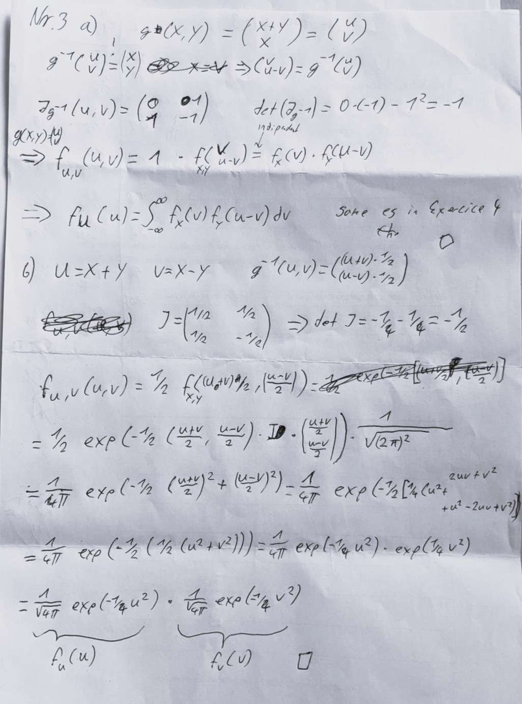

### 1.



### 2.
#### a)

**Given:** $X$ is a continuous random variable with CDF $F_X$ and PDF $f_X$. 
We consider the linear transformation $Y := rX + s$ for some $r, s \in \mathbb{R}$.

#### CDF of Y:

Starting with the CDF method:
$$F_Y(y) = P(Y \leq y) = P(rX + s \leq y)$$

**Case 1:** $r > 0$
$$rX + s \leq y \implies X \leq \frac{y-s}{r}$$
$$F_Y(y) = F_X\left(\frac{y-s}{r}\right)$$

**Case 2:** $r < 0$
$$rX + s \leq y \implies X \geq \frac{y-s}{r}$$
$$F_Y(y) = 1 - F_X\left(\frac{y-s}{r}\right)$$

**Case 3:** $r = 0$
$$Y = s \text{ (constant)}, \quad F_Y(y) = P(Y \leq y) = P(s \leq y) = 
\begin{cases}
0 & \text{if } y < s \\
1 & \text{if } y \geq s
\end{cases}$$

#### PDF of Y:

For $r \neq 0$, we obtain the PDF by differentiating the CDF:

$$f_Y(y) = \frac{d}{dy}F_Y(y)$$

Using the chain rule:

- For $r > 0$: $f_Y(y) = f_X\left(\frac{y-s}{r}\right) \cdot \frac{1}{r} = \frac{1}{|r|}f_X\left(\frac{y-s}{r}\right)$
- For $r < 0$: $f_Y(y) = -f_X\left(\frac{y-s}{r}\right) \cdot \frac{1}{r} = \frac{1}{|r|}f_X\left(\frac{y-s}{r}\right)$

#### Answer:

$$\boxed{F_Y(y) = \begin{cases}
F_X\left(\frac{y-s}{r}\right) & \text{if } r > 0 \\
1 - F_X\left(\frac{y-s}{r}\right) & \text{if } r < 0 \\
\mathbb{1}_{y \geq s} & \text{if } r = 0
\end{cases}}$$

$$\boxed{f_Y(y) = \frac{1}{|r|} f_X\left(\frac{y-s}{r}\right) \quad \text{for } r \neq 0}$$

#### b)
**Given:**

- Random variable $X$ with PDF $f_X(x) = e^{-x}$ for $x > 0$
- Transformation $Y := g(X) = \log X$ (natural logarithm)

**To verify:** $f_Y(y) = e^y e^{-e^y}$ for $y \in \mathbb{R}$

Since $X > 0$:

- As $X \to 0^+$: $Y = \log X \to -\infty$
- As $X \to \infty$: $Y = \log X \to +\infty$

Therefore, the support of $Y$ is $\mathbb{R}$ (all real numbers).

Given $y = \log x$, we solve for $x$:

$$x = g^{-1}(y) = e^y$$

We can verify: $\log(e^y) = y$

The function $g(x) = \log x$ is strictly increasing for $x > 0$, so:
$$g'(x) = \frac{1}{x} > 0 \quad \text{for all } x > 0$$

This confirms that $g$ is monotone increasing, which allows us to use the transformation formula.

For a monotone transformation, the PDF transformation formula is:
$$f_Y(y) = f_X(g^{-1}(y)) \cdot \left|\frac{d}{dy}g^{-1}(y)\right|$$


$$\frac{d}{dy}g^{-1}(y) = \frac{d}{dy}e^y = e^y$$

Since $e^y > 0$ for all $y \in \mathbb{R}$:
$$\left|\frac{d}{dy}e^y\right| = e^y$$

$$f_Y(y) = f_X(e^y) \cdot e^y$$

We have $f_X(x) = e^{-x}$, so substituting $x = e^y$:
$$f_X(e^y) = e^{-e^y}$$

Therefore:
$$f_Y(y) = e^{-e^y} \cdot e^y = e^y e^{-e^y}$$


#### c)

**Given:**

- $X \sim \text{Unif}(0,1)$, so $f_X(x) = 1$ for $x \in (0,1)$
- Transformation $Y := \sqrt{X}$

**Task:** 

1. Find the distribution of $Y$
2. Verify using simulation in R
3. Compute $\mathbb{E}[Y]$ using both LOTUS and the derived density


Since $X \in (0,1)$:

- As $X \to 0^+$: $Y = \sqrt{X} \to 0$
- As $X \to 1$: $Y = \sqrt{X} \to 1$

Therefore, the support of $Y$ is $(0,1)$.

Given $y = \sqrt{x}$, we solve for $x$:
$$y = \sqrt{x} \implies y^2 = x$$

So the inverse function is:
$$x = g^{-1}(y) = y^2$$


The function $g(x) = \sqrt{x}$ is strictly increasing for $x > 0$:
$$g'(x) = \frac{1}{2\sqrt{x}} > 0 \quad \text{for all } x > 0$$

This confirms monotonicity, allowing to use the transformation formula.

$$\frac{d}{dy}g^{-1}(y) = \frac{d}{dy}y^2 = 2y$$

Since $y > 0$ on the support:
$$\left|\frac{d}{dy}y^2\right| = 2y$$

$$f_Y(y) = f_X(g^{-1}(y)) \cdot \left|\frac{d}{dy}g^{-1}(y)\right|$$

Substituting:

- $f_X(y^2) = 1$ (since $y^2 \in (0,1)$ when $y \in (0,1)$)
- $\left|\frac{d}{dy}y^2\right| = 2y$

Therefore:
$$f_Y(y) = 1 \cdot 2y = 2y \quad \text{for } y \in (0,1)$$


$$\int_0^1 2y \, dy = \left[y^2\right]_0^1 = 1 - 0 = 1$$

#### Computing $\mathbb{E}[Y]$

##### Method 1: Using LOTUS (Law of the Unconscious Statistician)

$$\mathbb{E}[Y] = \mathbb{E}[\sqrt{X}] = \int_0^1 \sqrt{x} \cdot f_X(x) \, dx = \int_0^1 \sqrt{x} \cdot 1 \, dx$$

$$= \int_0^1 x^{1/2} \, dx = \left[\frac{x^{3/2}}{3/2}\right]_0^1 = \left[\frac{2x^{3/2}}{3}\right]_0^1 = \frac{2}{3}$$

##### Method 2: Using the derived density $f_Y(y) = 2y$

$$\mathbb{E}[Y] = \int_0^1 y \cdot f_Y(y) \, dy = \int_0^1 y \cdot 2y \, dy = \int_0^1 2y^2 \, dy$$

$$= \left[\frac{2y^3}{3}\right]_0^1 = \frac{2}{3}$$

Both methods give:
$$\boxed{\mathbb{E}[Y] = \frac{2}{3}}$$

---

#### R Code for Simulation
```{r}
set.seed(123)

# samples
n <- 10^6
X <- runif(n, 0, 1)
Y <- sqrt(X)

# histogram with theoretical density overlay
hist(Y, freq = FALSE, breaks = 50, 
     main = "Distribution of Y = sqrt(X), X ~ Unif(0,1)",
     xlab = "y", ylab = "Density",
     col = "lightblue", border = "white")

# theoretical density f_Y(y) = 2y
y_vals <- seq(0, 1, length.out = 1000)
f_Y <- 2 * y_vals
lines(y_vals, f_Y, col = "red", lwd = 2)
legend("topleft", 
       legend = c("Simulated histogram", "Theoretical f_Y(y) = 2y"),
       col = c("lightblue", "red"), 
       lwd = c(10, 2), 
       bty = "n")

E_Y_lotus <- mean(Y)
cat("E[Y] using simulation (LOTUS):", E_Y_lotus, "\n")
```


The simulation closely matches the theoretical value of $\frac{2}{3} \approx 0.6667$, confirming the derivation.


### 3.


### 4.

#### Probability Integral Transform

**Goal:** Show that $Y = F_X(X) \sim \text{Unif}(0,1)$

**Proof:** For any $y \in [0,1]$, we compute the CDF of $Y$:

$$P(Y \leq y) = P(F_X(X) \leq y) = P(X \leq F_X^{-1}(y)) = F_X(F_X^{-1}(y)) = y$$

Since $P(Y \leq y) = y$ for all $y \in [0,1]$, we have $Y \sim \text{Unif}(0,1) \quad \square$. 

**Intuition:** Applying a CDF to its own random variable "uniformizes" it.

---

#### Inverse Transform

**Goal:** Show that if $U \sim \text{Unif}(0,1)$ and $Z = F_X^{-1}(U)$, then $F_Z = F_X$

**Proof:** For any $z \in I$:

$$P(Z \leq z) = P(F_X^{-1}(U) \leq z) = P(U \leq F_X(z)) = F_X(z)$$

The last equality holds because $U \sim \text{Unif}(0,1)$. Thus $F_Z = F_X\quad \square$. 

**Conclusion:** We can generate any continuous distribution by applying $F_X^{-1}$ to uniform random numbers!

---

#### Simulation in R

Given density: $f(x) = \frac{2}{(x+1)^3}$ for $x > 0$

**the CDF by integration:**
$$F(x) = \int_0^x \frac{2}{(t+1)^3} dt = 1 - \frac{1}{(x+1)^2}$$

**inverse CDF by solving $u = F(x)$ for $x$:**
$$F^{-1}(u) = \frac{1}{\sqrt{1-u}} - 1$$

```{r}
set.seed(123)

# inverse CDF
F_inv <- function(u) {
  1 / sqrt(1 - u) - 1
}

# true density
f <- function(x) {
  2 / (x + 1)^3
}

# n = 10^5 samples using inverse transform
n <- 1e5
U <- runif(n)
X <- F_inv(U)

# Filter values < 10 for better visualization (as suggested)
X_filtered <- X[X < 10]
cat("Percentage of values < 10:", 
    round(100 * length(X_filtered) / n, 2), "%\n")

# histogram with theoretical density overlay
hist(X_filtered, breaks = 50, probability = TRUE,
     main = "Simulated vs Theoretical Density",
     xlab = "x", col = "lightblue", border = "white")

# the true density
curve(f(x), from = 0, to = 10, add = TRUE, 
      col = "red", lwd = 2)
legend("topright", legend = c("Simulated", "True Density"),
       fill = c("lightblue", NA), border = c("black", NA),
       lty = c(NA, 1), col = c(NA, "red"), lwd = c(NA, 2))
```

**Verification:** The histogram closely matches the theoretical density, confirming the implementation! The heavy tail explains why most values are concentrated near 0.


### 6.
#### a)
```{r}
library(ggplot2)

x_a <- seq(-10, 10, length.out=500)

df_a <- data.frame(
  x = x_a,
  normal = dnorm(x_a, mean = 2, sd = 1),
  cauchy = dcauchy(x_a, location = 2, scale = 1)
)

ggplot() +
  geom_line(data=df_a, aes(x=x, y=normal), color='blue') +
  geom_line(data=df_a, aes(x=x, y=cauchy), color='red') +
  labs(
    y = "Density"
  ) +
  theme_minimal()
```

The chauchy distribution has heavier tails then the normal distribution

#### b)
```{r}
set.seed(123)

x_b <- rnorm(5000, mean = 2, sd = 1)

cum_mean <- cumsum(x_b) / seq_along(x_b)

df_b <- data.frame(
  n = seq_along(x_b),
  cum_mean = cum_mean
)

ggplot(df_b, aes(x = n, y = cum_mean)) +
  geom_line(color = "blue") +
  geom_hline(yintercept = 2, color = "red", linetype = "dashed") +
  labs(
    x = "Sample size n",
    y = "Cumulative mean",
    title = "Cumulative Mean for Samples from N(2, 1)"
  ) +
  theme_minimal()
```

#### c)
```{r}
x_c <- rcauchy(15000, location=2, scale=1)

cum_mean <- cumsum(x_c) / seq_along(x_c)

df_c <- data.frame(
  n = seq_along(x_c),
  cum_mean = cum_mean
)

ggplot(df_c, aes(x = n, y = cum_mean)) +
  geom_line(color = "blue") +
  geom_hline(yintercept = 2, color = "red", linetype = "dashed") +
  labs(
    x = "Sample size n",
    y = "Cumulative mean",
  ) +
  theme_minimal()
```

We cannot observe a similar convergence. The chauchy distribution has no mean 
which is neccessary for R.V.'s to follow the LLN.


### 7.

#### Theory: The Central Limit Theorem

Let $X_i$, $i \geq 1$ be i.i.d. random variables with $\mathbb{E}[X_i] = \mu$ and $\text{Var}(X_i) = \sigma^2 > 0$.

The **standardized sum** is defined as:
$$Z_n := \frac{\bar{X}_n - \mu}{\sigma/\sqrt{n}} = \frac{\sum_{i=1}^n X_i - n\mu}{\sqrt{n}\sigma}$$

**CLT Statement:** As $n \to \infty$, we have $Z_n \xrightarrow{d} \mathcal{N}(0,1)$.


#### Poisson(0.5) Distribution

For $X_i \sim \text{Pois}(0.5)$: $\mu = 0.5$, $\sigma^2 = 0.5$
```{r}
# parameters
set.seed(42)
k <- 1000  # simulations
mu_pois <- 0.5
sigma_pois <- sqrt(0.5)

# to generate k samples of Z_n
simulate_CLT <- function(n, k, mu, sigma, dist_func) {
  Z_samples <- numeric(k)
  for (i in 1:k) {
    X <- dist_func(n)  # Generate n i.i.d. samples
    X_bar <- mean(X)
    Z_samples[i] <- (X_bar - mu) / (sigma / sqrt(n))
  }
  return(Z_samples)
}

n_values <- c(5, 10, 30, 100)

par(mfrow = c(2, 2))
for (n in n_values) {
  Z_n <- simulate_CLT(n, k, mu_pois, sigma_pois, 
                      function(n) rpois(n, lambda = 0.5))
  
  hist(Z_n, breaks = 30, probability = TRUE,
       main = paste("Pois(0.5): n =", n),
       xlab = expression(Z[n]), col = "lightblue", 
       border = "white", xlim = c(-4, 4))
  
  # standard normal density
  curve(dnorm(x, 0, 1), from = -4, to = 4, 
        add = TRUE, col = "red", lwd = 2)
}
```

**Observation:** As $n$ increases, the histogram converges to $\mathcal{N}(0,1)$ (red curve).


#### Exponential(2) Distribution

For $X_i \sim \text{Exp}(2)$: $\mu = 1/2 = 0.5$, $\sigma^2 = 1/4 = 0.25$
```{r}
mu_exp <- 1/2
sigma_exp <- 1/2

par(mfrow = c(2, 2))
for (n in n_values) {
  Z_n <- simulate_CLT(n, k, mu_exp, sigma_exp, 
                      function(n) rexp(n, rate = 2))
  
  hist(Z_n, breaks = 30, probability = TRUE,
       main = paste("Exp(2): n =", n),
       xlab = expression(Z[n]), col = "lightgreen", 
       border = "white", xlim = c(-4, 4))
  
  # standard normal density
  curve(dnorm(x, 0, 1), from = -4, to = 4, 
        add = TRUE, col = "red", lwd = 2)
}
```

**Observation:** Despite the exponential being highly skewed (unlike Poisson), $Z_n$ still converges to $\mathcal{N}(0,1)$ as $n$ increases!


#### Comparison: Does the Result Depend on Distribution?
```{r}
layout(matrix(1:2, nrow = 1))

# Poisson
Z_pois <- simulate_CLT(30, k, mu_pois, sigma_pois, 
                       function(n) rpois(n, lambda = 0.5))
hist(Z_pois, breaks = 30, probability = TRUE,
     main = "Pois(0.5), n = 30",
     xlab = expression(Z[n]), col = "lightblue", 
     border = "white", xlim = c(-4, 4), ylim = c(0, 0.5))
curve(dnorm(x, 0, 1), add = TRUE, col = "red", lwd = 2)

# Exponential
Z_exp <- simulate_CLT(30, k, mu_exp, sigma_exp, 
                      function(n) rexp(n, rate = 2))
hist(Z_exp, breaks = 30, probability = TRUE,
     main = "Exp(2), n = 30",
     xlab = expression(Z[n]), col = "lightgreen", 
     border = "white", xlim = c(-4, 4), ylim = c(0, 0.5))
curve(dnorm(x, 0, 1), add = TRUE, col = "red", lwd = 2)

# Reset
layout(1)
```


#### Answer:

**No** The CLT is universal:

- The **limiting distribution** $\mathcal{N}(0,1)$ is always the same, regardless of the original distribution
- Only the **speed of convergence** depends on the distribution:

  - Symmetric distributions (like Poisson) converge faster
  - Skewed distributions (like Exponential) need larger $n$ for good approximation
- As long as $\mathbb{E}[X_i] = \mu$ and $\text{Var}(X_i) = \sigma^2 < \infty$ exist, CLT holds!