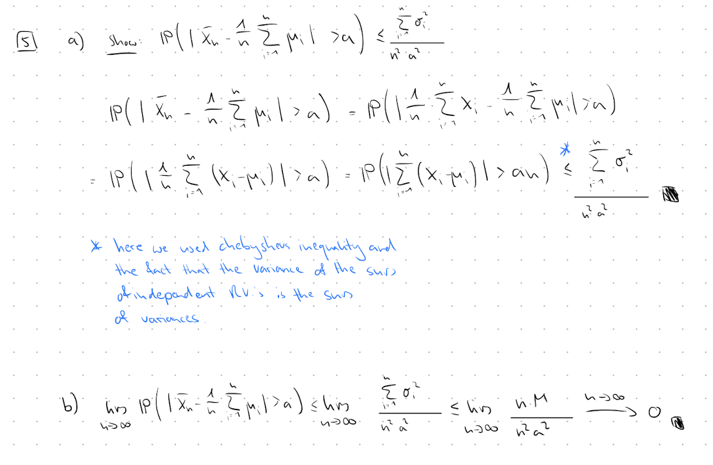

### 2.
#### a) & b)
### 3.
#### a) & b)
### 4.
#### a) & b)
### 5.
#### a) & b)



### 6.
#### a)
```{r}
library(ggplot2)

x_a <- seq(-10, 10, length.out=500)

df_a <- data.frame(
  x = x_a,
  normal = dnorm(x_a, mean = 2, sd = 1),
  cauchy = dcauchy(x_a, location = 2, scale = 1)
)

ggplot() +
  geom_line(data=df_a, aes(x=x, y=normal), color='blue') +
  geom_line(data=df_a, aes(x=x, y=cauchy), color='red') +
  labs(
    y = "Density"
  ) +
  theme_minimal()
```

The chauchy distribution has heavier tails then the normal distribution

#### b)
```{r}
set.seed(123)

x_b <- rnorm(5000, mean = 2, sd = 1)

cum_mean <- cumsum(x_b) / seq_along(x_b)

df_b <- data.frame(
  n = seq_along(x_b),
  cum_mean = cum_mean
)

ggplot(df_b, aes(x = n, y = cum_mean)) +
  geom_line(color = "blue") +
  geom_hline(yintercept = 2, color = "red", linetype = "dashed") +
  labs(
    x = "Sample size n",
    y = "Cumulative mean",
    title = "Cumulative Mean for Samples from N(2, 1)"
  ) +
  theme_minimal()
```

#### c)
```{r}
x_c <- rcauchy(15000, location=2, scale=1)

cum_mean <- cumsum(x_c) / seq_along(x_c)

df_c <- data.frame(
  n = seq_along(x_c),
  cum_mean = cum_mean
)

ggplot(df_c, aes(x = n, y = cum_mean)) +
  geom_line(color = "blue") +
  geom_hline(yintercept = 2, color = "red", linetype = "dashed") +
  labs(
    x = "Sample size n",
    y = "Cumulative mean",
  ) +
  theme_minimal()
```

We cannot observe a similar convergence. The chauchy distribution has no mean 
which is neccessary for R.V.'s to follow the LLN.


### 7.
#### a) & b)