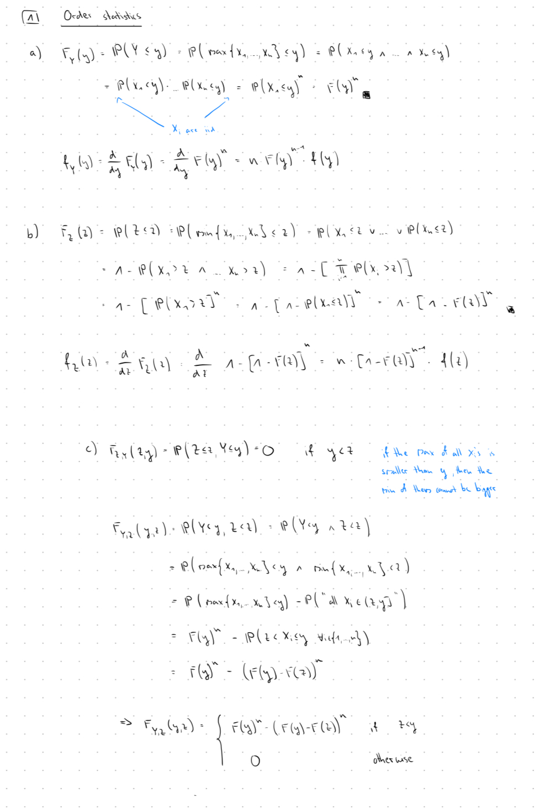

### 1.




.png)

### 2.

### 3.
#### a)

$$P(|X-\mu| \geq a) \leq \frac{Var(X)}{a^2}, \forall a >0$$
```{r}
library("UsingR")
var(exec.pay)/(3*sd(exec.pay))**2
```


#### b)
```{r}
mu <- mean(exec.pay)
sd <- sd(exec.pay)

lb <- mu - 3*sd
ub <- mu + 3*sd

1-(pnorm(ub, mean = mu, sd = sd)-pnorm(lb, mean = mu, sd = sd))
```


#### c)
$$z_i := \frac{1}{s}(x_i-\bar{x}), i = 1, ... , n$$
$$sz_i = (x_i-\bar{x}), i = 1, ... , n$$  
For $z_i = 3$ is the deviation from the mean, three times the standard deviation. 

#### d)

```{r}
# install.packages("UsingR")
# require("UsingR")
summary(exec.pay)
head(exec.pay)
boxplot(exec.pay, horizontal = TRUE)
boxplot(exec.pay, horizontal = TRUE, outline = FALSE)
```

From the second boxplot it is clear that the outliers are after the second whisker(about 76).

#### e)
```{r}
mean <- mean(exec.pay)
sd <- sd(exec.pay)
z_score <- (exec.pay-mean)/sd
z_score   # or just < - scale(exec.pay)
```

```{r}
propb_3sd <- mean(abs(z_score) > 3)
propb_3sd


cat("Comparison: normal distribution 0.27% < z-score 1.51% << Chebyshevs inequality 11%")
```


#### f)
**definition of z-score**

$$z_i = \frac{1}{s}(x_i - \bar{x})$$

where $s$ is the sample standard deviation with denominator $n$:

$$s = \sqrt{\frac{1}{n}\sum_{i=1}^{n}(x_i - \bar{x})^2}$$


From the z-score definition:
$$x_i - \bar{x} = s \cdot z_i$$

**Substitute into the numerator**

$$\sum_{i=1}^{n}(x_i - \bar{x})^3 = \sum_{i=1}^{n}(s \cdot z_i)^3 = s^3 \sum_{i=1}^{n}z_i^3$$

**Substitute into the denominator**

$$\sum_{i=1}^{n}(x_i - \bar{x})^2 = \sum_{i=1}^{n}(s \cdot z_i)^2 = s^2 \sum_{i=1}^{n}z_i^2$$


Since $s^2 = \frac{1}{n}\sum_{i=1}^{n}(x_i - \bar{x})^2$, we have:

$$\sum_{i=1}^{n}(x_i - \bar{x})^2 = ns^2$$

Therefore:
$$s^2 \sum_{i=1}^{n}z_i^2 = ns^2$$

This implies:
$$\sum_{i=1}^{n}z_i^2 = n$$

**Simplify the denominator term**

$$\left[\sum_{i=1}^{n}(x_i - \bar{x})^2\right]^{3/2} = \left[s^2 \sum_{i=1}^{n}z_i^2\right]^{3/2} = [s^2 \cdot n]^{3/2} = s^3 \cdot n^{3/2}$$

**everything combined**

$$\sqrt{n} \cdot \frac{\sum_{i=1}^{n}(x_i - \bar{x})^3}{\left[\sum_{i=1}^{n}(x_i - \bar{x})^2\right]^{3/2}} = \sqrt{n} \cdot \frac{s^3 \sum_{i=1}^{n}z_i^3}{s^3 \cdot n^{3/2}}$$

$$= \sqrt{n} \cdot \frac{\sum_{i=1}^{n}z_i^3}{n^{3/2}} = \frac{n^\frac{1}{2}}{n^{3/2}} \sum_{i=1}^{n}z_i^3$$

$$= \frac{1}{n} \sum_{i=1}^{n}z_i^3$$


#### g)
From f);
```{r}
sum(z_score**3)/length(z_score)
```


#### h)

**definition of z-score**

$$z_i = \frac{1}{s}(x_i - \bar{x})$$

where $s$ is the sample standard deviation with denominator $n$:

$$s = \sqrt{\frac{1}{n}\sum_{i=1}^{n}(x_i - \bar{x})^2}$$


From the z-score definition:
$$x_i - \bar{x} = s \cdot z_i$$

**Substitute into the numerator**

$$\sum_{i=1}^{n}(x_i - \bar{x})^4 = \sum_{i=1}^{n}(s \cdot z_i)^4 = s^4 \sum_{i=1}^{n}z_i^4$$

**Substitute into the denominator**

$$\sum_{i=1}^{n}(x_i - \bar{x})^2 = \sum_{i=1}^{n}(s \cdot z_i)^2 = s^2 \sum_{i=1}^{n}z_i^2$$

**Recall from f) that $\sum_{i=1}^{n}z_i^2 = n$**


**Simplify the denominator term**

$$\left[\sum_{i=1}^{n}(x_i - \bar{x})^2\right]^2 = \left[s^2 \sum_{i=1}^{n}z_i^2\right]^2 = [s^2 \cdot n]^2 = s^4 \cdot n^2$$

**everything combined**

$$n \cdot \frac{\sum_{i=1}^{n}(x_i - \bar{x})^4}{\left[\sum_{i=1}^{n}(x_i - \bar{x})^2\right]^2} - 3 = n \cdot \frac{s^4 \sum_{i=1}^{n}z_i^4}{s^4 \cdot n^2} - 3$$

$$= n \cdot \frac{\sum_{i=1}^{n}z_i^4}{n^2} - 3 = \frac{1}{n}\sum_{i=1}^{n}z_i^4 - 3$$

**Why subtract 3?**

The subtraction of 3 is a normalization convention. For a standard normal distribution, the fourth moment $E[Z^4] = 3$ (since for $Z \sim N(0,1)$, we have $E[Z^4] = 3 \cdot (E[Z^2])^2 = 3 \cdot 1^2 = 3$).

By subtracting 3, we get:

- **Kurtosis = 0** for normal distributions (mesokurtic)
- **Kurtosis > 0** for distributions with heavy tails (leptokurtic)
- **Kurtosis < 0** for distributions with light tails (platykurtic)


#### i)
From g);

```{r}
sum(z_score**4-3)/length(z_score)

#(sum(z_score**4)-3*length(z_score))/length(z_score)
```


### 4.

### 5.


In this exercise we just have to modify the code from the lecture slides


```{r}


n <- 10e4


f<-function(x){sqrt(x+sqrt(x+sqrt(x+sqrt(x))))}


x<-seq(-0.5,4.5,length=1000)


plot(x,f(x),type="l",xlim=c(-1,5), ylim=c(0,3),bty="n",lwd=3)


h<-0 # absolute frequency of getting points under the curve f


for (i in 1:n){


  x<-runif(1,0,4)


  y<-runif(1,0,4)


  if (y<f(x)){


    h<-h+1


  } else {


  }


}


16*h/n # approximation of the grey area


```