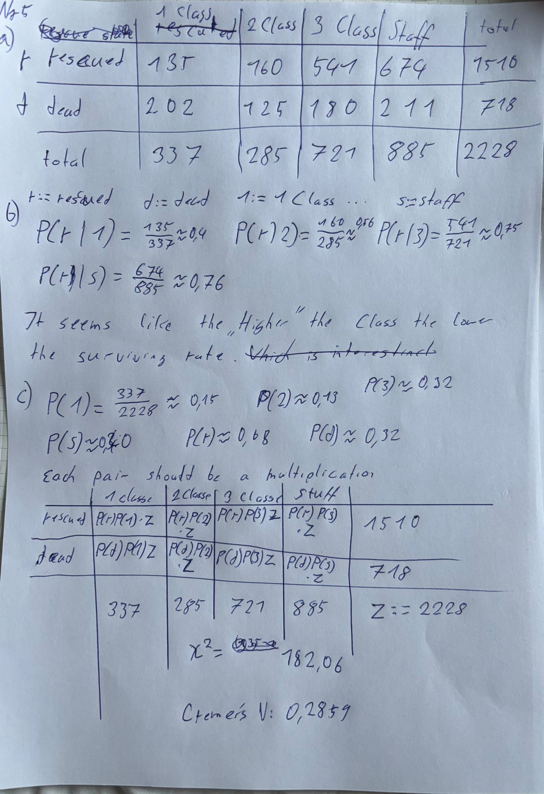
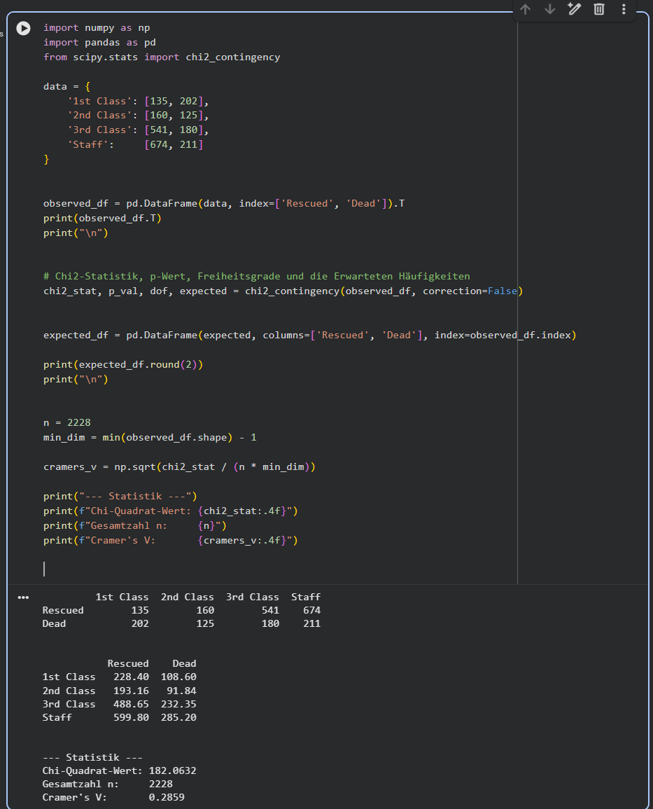

```{r setup, include=FALSE}
knitr::opts_chunk$set(fig.pos = 'H')
```

### 1. & 2.


---

### 3.

#### a)

Let $x \in \mathbb{R}$ be fixed. Then $x$ lies in exactly one class interval $I_k = (c_k, c_{k+1}]$.

We have:
$$nb\hat{f}_n(x) = \sum_{i=1}^{n} \mathbb{I}(X_i \in I_k)$$

This is just counting how many of the $X_i$ fall into the interval $I_k$.

Each indicator $\mathbb{I}(X_i \in I_k)$ is Bernoulli distributed with probability $p_k = \mathbb{P}(X_i \in I_k)$.

Since the $X_i$ are i.i.d., the sum of $n$ independent Bernoulli($p_k$) variables is binomial, so:

$$nb\hat{f}_n(x) \sim \text{Bin}(n, p_k)$$

**Mean:**
$$\mathbb{E}[nb\hat{f}_n(x)] = np_k$$
$$\Rightarrow \mathbb{E}[\hat{f}_n(x)] = \frac{p_k}{b}$$

**Variance:**
$$\text{Var}(nb\hat{f}_n(x)) = np_k(1-p_k)$$
$$\Rightarrow \text{Var}(\hat{f}_n(x)) = \frac{1}{n^2b^2} \cdot np_k(1-p_k) = \frac{p_k(1-p_k)}{nb^2}$$

#### b)

From (a) we know $\mathbb{E}[\hat{f}_n(x)] = \frac{p_k}{b}$.

We can write $p_k$ as:
$$p_k = \int_{c_k}^{c_{k+1}} f(t) \, dt$$

Since $f$ is continuous, by the mean value theorem there exists $\xi_k \in (c_k, c_{k+1})$ with:
$$\int_{c_k}^{c_{k+1}} f(t) \, dt = f(\xi_k) \cdot b$$

So:
$$\mathbb{E}[\hat{f}_n(x)] = \frac{f(\xi_k) \cdot b}{b} = f(\xi_k)$$

Now as $b \to 0$, the interval $I_k$ shrinks to the point $x$, so $\xi_k \to x$.

Since $f$ is continuous:
$$\lim_{b \to 0} \mathbb{E}[\hat{f}_n(x)] = \lim_{b \to 0} f(\xi_k) = f(x)$$

$\square$

#### c)

$$MSE = \mathbb{E}[(\hat{f}_n(x) - f(x))^2] = \text{Var}(\hat{f}_n(x)) + \left(\mathbb{E}[\hat{f}_n(x)] - f(x)\right)^2$$

From (a) we have:
$$\text{Var}(\hat{f}_n(x)) = \frac{p_k(1-p_k)}{nb^2}$$

From (b) we know $\mathbb{E}[\hat{f}_n(x)] = f(\xi_k)$ for some $\xi_k \in I_k$, so the bias is:
$$\text{Bias} = f(\xi_k) - f(x)$$

Therefore:
$$\mathbb{E}[(\hat{f}_n(x) - f(x))^2] = \frac{p_k(1-p_k)}{nb^2} + (f(\xi_k) - f(x))^2$$

**Taking the limit $b \to 0$ and $nb \to \infty$:**

For the bias term: As $b \to 0$, we have $\xi_k \to x$, so by continuity of $f$:
$$(f(\xi_k) - f(x))^2 \to 0$$

For the variance term: Since $p_k = \int_{c_k}^{c_{k+1}} f(t) \, dt = f(\xi_k) \cdot b$, we get $p_k(1-p_k) \leq p_k = f(\xi_k) \cdot b$.

So:
$$\frac{p_k(1-p_k)}{nb^2} \leq \frac{f(\xi_k) \cdot b}{nb^2} = \frac{f(\xi_k)}{nb} \to 0$$

as $nb \to \infty$.

Therefore:
$$\lim_{\substack{b \to 0 \\ nb \to \infty}} \mathbb{E}[(\hat{f}_n(x) - f(x))^2] = 0 \quad \square$$


#### d)

We apply Markov's inequality to the random variable $(\hat{f}_n(x) - f(x))^2$.

Markov's inequality says $\mathbb{P}(Y \geq a) \leq \frac{\mathbb{E}[Y]}{a}$ for $Y \geq 0$ and $a > 0$.

Let $Y = (\hat{f}_n(x) - f(x))^2$ and $a = \epsilon^2$. Then:

$$\mathbb{P}\left[(\hat{f}_n(x) - f(x))^2 \geq \epsilon^2\right] \leq \frac{\mathbb{E}[(\hat{f}_n(x) - f(x))^2]}{\epsilon^2}$$

This is equivalent to:
$$\mathbb{P}\left[|\hat{f}_n(x) - f(x)| \geq \epsilon\right] \leq \frac{\text{MSE}}{\epsilon^2}$$

From (c) we showed that MSE $\to 0$ as $b \to 0$ and $nb \to \infty$.

Since $\epsilon > 0$ is fixed, we have:
$$\mathbb{P}\left[|\hat{f}_n(x) - f(x)| > \epsilon\right] \leq \frac{\text{MSE}}{\epsilon^2} \to 0$$

Therefore $\hat{f}_n(x) \xrightarrow{P} f(x)$, which means $\hat{f}_n(x)$ is a consistent estimator for $f(x)$. $\square$


---

### 4.

#### a) 

```{r}
library("UsingR")

d <- density(pi2000)
hist(pi2000, breaks = 0:10-0.5, prob=TRUE, xlab = "digit", main = "Histogram with density estimate")
lines(d, col = "red", lwd = 1)
hist(pi2000, prob = TRUE, main = "Histogram with default breaks")
```

The argument `breaks = 0:10-0.5` centers the bins around the integer values 0-9, which makes sense since the data only contains digits 0-9. Without this, the default breaks might split the digits in awkward ways.

#### b)

```{r}
table(pi2000)
#cumsum(table(pi2000))

P <- ecdf(pi2000)
P(0.0)
plot(P, main = "Empirical CDF of pi-digits")
```


#### c) 

I suspect a **uniform distribution** on {0, 1, ..., 9}. Each digit appears roughly equally often(around 200 times out of 2000), which is consistent with a discrete uniform distribution with $p = 1/10$ for each digit.

---

### 5.








So there is a association between  travel class and rescue status but it could be stronger but it is not neglectabel


d)


Conclusion: There is a depandancy between  travel class and rescue status which may seem surprising but is shown by the data


### 6.

```{r}
library(MASS)
data(Animals)


#a)

cor(Animals$body, Animals$brain, method = "pearson")
plot(Animals$body, Animals$brain, main="Original Scale")
plot(log(Animals$body), log(Animals$brain), main="Log-Log Scale")


#b)

dinos <- c("Brachiosaurus", "Dipliodocus", "Triceratops")
Animals_no_dino <- Animals[!(row.names(Animals) %in% dinos), ]
is_dino <- rownames(Animals) %in% dinos
plot(Animals$body, Animals$brain, main="Original Scale")
points(Animals$body[is_dino], Animals$brain[is_dino], 
       col = "red", pch = 17, cex = 1.5)


cor(Animals_no_dino$body, Animals_no_dino$brain, method = "pearson")

#c)
# Spearman mit Dinos

cor(Animals$body, Animals$brain, method = "spearman")

# Spearman ohne Dinos

cor(Animals_no_dino$body, Animals_no_dino$brain, method = "spearman")
```


It seams that the Spearmans rank is more robust to the presense of outliers as also mensiont in the lectures
