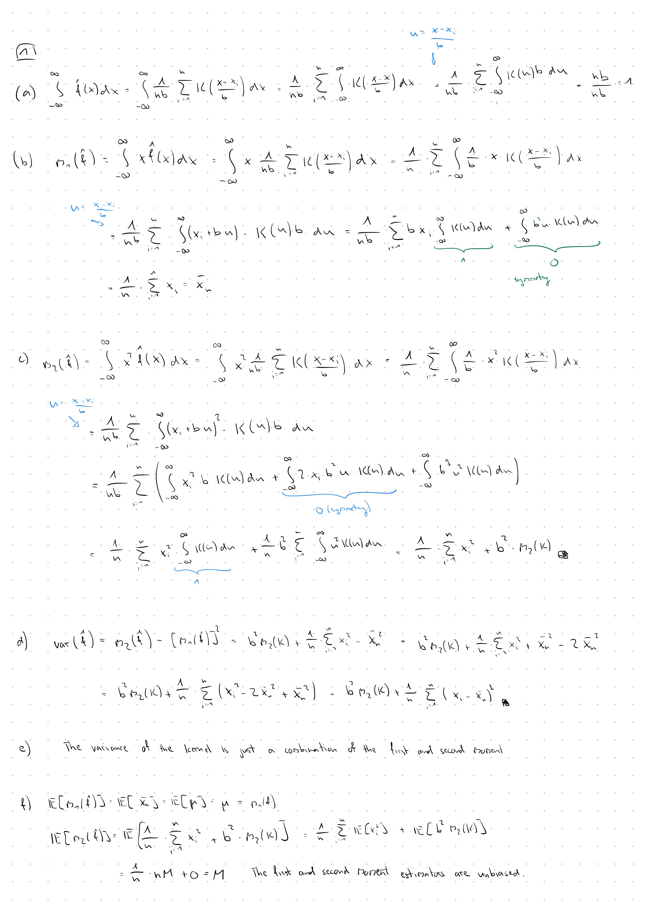

```{r setup, include=FALSE}
knitr::opts_chunk$set(fig.pos = 'H')
```


### 1.



### 2.


### 3.

#### a)

```{r}
cat("Minimum:", min(WWWusage), "\n")
cat("Maximum:", max(WWWusage), "\n")
cat("Mean:", mean(WWWusage), "\n")
cat("Median:", median(WWWusage), "\n")
cat("IQR:", IQR(WWWusage), "\n")

## OR ##
summary(WWWusage)

getMode <- function(x) {  # from stackoverflow-site
  uniq_vals <- unique(x)
  uniq_vals[which.max(tabulate(match(x, uniq_vals)))]
}

cat("Mode:", getMode(WWWusage), "\n")
```


#### b)

```{r}
Q1 <- quantile(WWWusage, 0.25)
Q3 <- quantile(WWWusage, 0.75)
IQR_val <- IQR(WWWusage)

# Calculate the outlier boundaries
lower_bound <- Q1 - 1.5 * IQR_val
upper_bound <- Q3 + 1.5 * IQR_val
outliers <- c()

for (i in WWWusage) {
  if (i < lower_bound | i > upper_bound) {
    cat("outlier found:", i, "\n")
    outliers <- c(outliers, i)
  }
}
outliers
```


#### c)

```{r}
Q1 <- quantile(WWWusage, 0.25)
Q3 <- quantile(WWWusage, 0.75)
med <- median(WWWusage)
IQR_val <- IQR(WWWusage)

# Mode function
getMode <- function(x) {
  uniq_vals <- unique(x)
  uniq_vals[which.max(tabulate(match(x, uniq_vals)))]
}
mode_val <- getMode(WWWusage)


lower_whisker <- max(min(WWWusage), Q1 - 1.5 * IQR_val)
upper_whisker <- min(max(WWWusage), Q3 + 1.5 * IQR_val)


boxplot(WWWusage,horizontal = TRUE, main = "Boxplot of WWWusage", ylab = "Users")

abline(v = med, col = "blue", lwd = 2)         
abline(v = mode_val, col = "red", lwd = 2)      
abline(v = Q1, col = "green", lwd = 2, lty = 3)          
abline(v = Q3, col = "orange", lwd = 2, lty = 3)         
abline(v = lower_whisker, col = "purple", lwd = 2, lty = 4)  
abline(v = upper_whisker, col = "brown", lwd = 2, lty = 4)  


legend("topright", 
       legend = c(paste("Median =", med), paste("Mode =", mode_val),
                  paste("Q1 =", Q1), paste("Q3 =", Q3),
                  paste("Lower Whisker =", lower_whisker),
                  paste("Upper Whisker =", upper_whisker)),
       col = c("blue", "red", "green", "orange", "purple", "brown"),
       lty = c(1, 1, 3, 3, 4, 4),
       lwd = 2)
```

#### d)

```{r}
histo <- hist(WWWusage)
histo

#length(unique(WWWusage)) data points overlap, so it is better to use jitter();
rug(jitter(WWWusage), col = "blue")
str(histo)
```

Since $equidist = TRUE, the first two breaks are enough to calculate the bin size:
$100-80=20$

#### (e) Probability Estimation for Bin (100, 110]

```{r}
histo <- hist(WWWusage, breaks = seq(80, 230, by = 10),
              main = "Histogram with Custom Breaks",
              xlab = "Users")

histo$breaks
histo$counts
histo$density

```

From histogram outputs, one can see, that the density for the desired bin is $0.005$.
Thus, the probability is equal to the bin size times this density: $10\cdot 0.005= 0.05$.

```{r}
#The second option is to calculate the probability directly using the counts;
5/sum(histo$counts)
```


#### (f) Kernel Density Plots

```{r}
hist(WWWusage, prob = TRUE, xlab = "Users", ylim = c(0, 0.015),
     main = "Histogram with different Kernel Densities")

lines(density(WWWusage, kernel = "gaussian"), col = "red", lwd = 2)
lines(density(WWWusage, kernel = "epanechnikov"), col = "blue", lwd = 2)
lines(density(WWWusage, kernel = "rectangular"), col = "green", lwd = 2)
lines(density(WWWusage, kernel = "triangular"), col = "yellow", lwd = 2)

legend("topright", 
       legend = c("Gaussian", "Epanechnikov", "Rectangular", "Triangular"),
       col = c("red", "blue", "green", "yellow"),
       lwd = 2)
```

```{r}
# Varying the bandwidth for Gaussian
par(mfrow = c(2, 2))

hist(WWWusage, prob = TRUE, main = "Small Bandwidth (bw = 5)", ylim = c(0, 0.025))
lines(density(WWWusage, kernel = "gaussian", bw = 5), col = "red", lwd = 2)

hist(WWWusage, prob = TRUE, main = "Default Bandwidth", ylim = c(0, 0.025))
lines(density(WWWusage, kernel = "gaussian"), col = "blue", lwd = 2)

hist(WWWusage, prob = TRUE, main = "Large Bandwidth (bw = 30)", ylim = c(0, 0.025))
lines(density(WWWusage, kernel = "gaussian", bw = 30), col = "green", lwd = 2)

hist(WWWusage, prob = TRUE, main = "Very Large Bandwidth (bw = 50)", ylim = c(0, 0.025))
lines(density(WWWusage, kernel = "gaussian", bw = 50), col = "purple", lwd = 2)

# Varying the bandwidth for Rectangular
par(mfrow = c(2, 2))

hist(WWWusage, prob = TRUE, main = "Small Bandwidth (bw = 5)", ylim = c(0, 0.025))
lines(density(WWWusage, kernel = "rectangular", bw = 5), col = "red", lwd = 2)

hist(WWWusage, prob = TRUE, main = "Default Bandwidth", ylim = c(0, 0.025))
lines(density(WWWusage, kernel = "rectangular"), col = "blue", lwd = 2)

hist(WWWusage, prob = TRUE, main = "Large Bandwidth (bw = 30)", ylim = c(0, 0.025))
lines(density(WWWusage, kernel = "rectangular", bw = 30), col = "green", lwd = 2)

hist(WWWusage, prob = TRUE, main = "Very Large Bandwidth (bw = 50)", ylim = c(0, 0.025))
lines(density(WWWusage, kernel = "rectangular", bw = 50), col = "purple", lwd = 2)
```


- **Kernel types:** The Gaussian kernel produces the smoothest curve. The rectangular kernel produces a more "blocky" estimate. Epanechnikov and triangular kernels are in between.

- **Bandwidth effect:** 
  - Small bandwidth (bw = 5): Very wiggly curve, captures local fluctuations but may overfit
  - Default bandwidth: Good balance between smoothness and detail
  - Large bandwidth (bw = 30, 50): Very smooth curve, may underfit and miss important features of the distribution
  
**$\rightarrow$ Bandwidth has a much greater influence than the choice of kernel.**

---

### 4.

```{r}
load("bodytemp.rda")
str(bodytemp)
#View(bodytemp)
```
```{r}
# Separate data by gender
males <- bodytemp[bodytemp$gender == "male", ]
females <- bodytemp[bodytemp$gender == "female", ]
```

#### a)
```{r}
par(mfrow = c(1, 2), mar = c(4, 4, 7, 0))

plot(males$temperature, males$heart.rate,
     main = "Males: Heart Rate vs Temperature",
     xlab = "Body Temperature (F)",
     ylab = "Heart Rate (bpm)",
     col = "blue", pch = 16)

plot(females$temperature, females$heart.rate,
     main = "Females: Heart Rate vs Temperature",
     xlab = "Body Temperature (F)",
     ylab = "Heart Rate (bpm)",
     col = "red", pch = 16)

```

Both scatterplots show a weak positive relationship between body temperature and heart rate.

#### b)
```{r}
cat("Pearson Correlation:\n")
cat("Males:", cor(males$temperature, males$heart.rate, method = "pearson"), "\n")
cat("Females:", cor(females$temperature, females$heart.rate, method = "pearson"), "\n")

cat("\nSpearman's Rank Correlation:\n")
cat("Males:", cor(males$temperature, males$heart.rate, method = "spearman"), "\n")
cat("Females:", cor(females$temperature, females$heart.rate, method = "spearman"), "\n")
```

#### c)
```{r}
plot(bodytemp$temperature, bodytemp$heart.rate,
     main = "Heart Rate vs Temperature by Gender",
     xlab = "Body Temperature (F)",
     ylab = "Heart Rate (bpm)",
     col = ifelse(bodytemp$gender == "male", "blue", "red"),
     pch = ifelse(bodytemp$gender == "male", 6, 2))

legend("topleft",
       legend = c("Male", "Female"),
       col = c("blue", "red"),
       pch = c(6, 2))

#cor(bodytemp$temperature, bodytemp$heart.rate, method = "pearson")
#cor(bodytemp$temperature, bodytemp$heart.rate, method = "spearman")
```

The relationship appears similar for both genders with weak positive correlation.