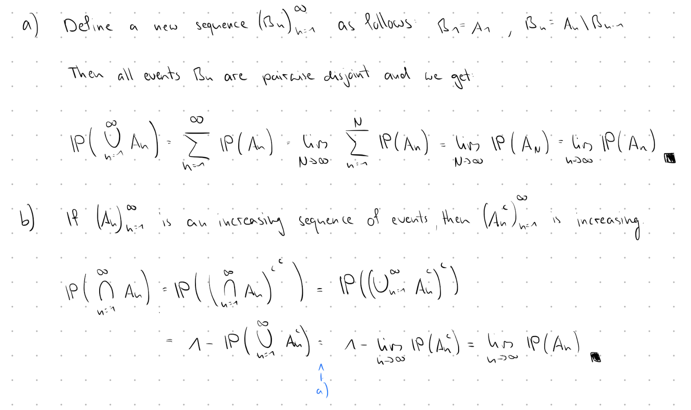
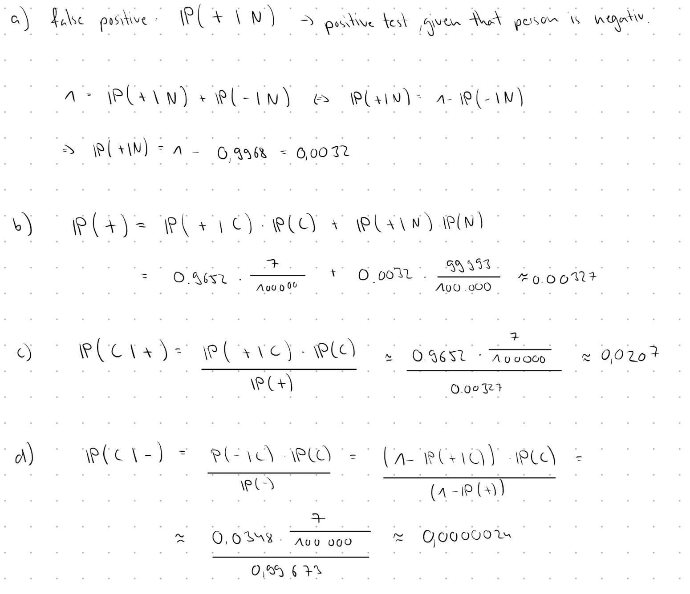

```{r setup, include=FALSE}
knitr::opts_chunk$set(echo = TRUE)
```

## Part I

##### **Topic**: Probability measures and distribution functions
### Exercise 1



### Aufgabe 2

Let $(\Omega, \mathcal{A}, P)$ be a probability space and $X: \Omega \to \mathbb{R}$ be a random variable.

**Definition:** The cumulative distribution function (CDF) of $X$ is defined by
$$F(x) = P(X \leq x) \quad \text{for all } x \in \mathbb{R}$$


#### a) Property 1: Monotonicity

**Theorem:** $F$ is monotonically increasing, i.e., for $x_1 < x_2$ we have $F(x_1) \leq F(x_2)$.

**Proof:**


$$A_1  = \{\omega \in \Omega: X(\omega)\leq x_1\}$$
$$A_2  = \{\omega \in \Omega: X(\omega)\leq x_2\}$$
Let $x_1 < x_2$. Then for the events:
$$A_1 \subseteq A_2$$
and thus
$$P(A_1) \leq P(A_2)$$
which is equal to 
$$F(x) \leq F(y)$$ $\square$

---


$$\bigcup_{n=1}^\infty A_n = \{X \leq n \text{ für mindestens ein } n\} = \Omega$$

$$\lim_{n \to \infty} P(A_n) = P\left(\bigcup_{n=1}^\infty A_n\right)$$
Also:

 $$\lim_{n \to \infty} F(n) = P(\Omega) = 1 \quad\square$$

---

#### b) Property 2: Limits

##### Part a: Limit at $-\infty$

**Theorem:** $\lim_{x \to -\infty} F(x) = 0$

**Proof:**

Let $(x_n)_{n \in \mathbb{N}}$ be a sequence with $x_n \to -\infty$ and $x_n \downarrow$ (e.g., $x_n = -n$).

Set $A_n = \{X \leq x_n\}$. Then:

* $(A_n)$ is a decreasing sequence of events and we have continuity from above $A_n\downarrow$
* $\bigcap_{n=1}^\infty A_n = \emptyset$ (since $x_n \rightarrow -\infty$)

By continuity from above:
$$\lim_{n \to \infty} P(A_n) = P\left(\bigcap_{n=1}^\infty A_n\right) = P(\emptyset) = 0$$

Therefore 

$$\lim_{n \to \infty} F(x_n) = 0 \quad \square$$

---

##### Part b: Limit at $+\infty$

**Theorem:** $\lim_{x \to +\infty} F(x) = 1$

**Proof:**

Let $(x_n)_{n \in \mathbb{N}}$ be a sequence with $x_n \to +\infty$ and $x_n \uparrow$ (e.g., $x_n = n$).

Set $A_n = \{X \leq x_n\}$. Then:

* $(A_n)$ is an increasing sequence of events and we have continuity from below $A_n\uparrow$
* $\bigcup_{n=1}^\infty A_n = \Omega$ (since $x_n \rightarrow \infty$)

By continuity from below:
$$\lim_{n \to \infty} P(A_n) = P\left(\bigcup_{n=1}^\infty A_n\right) = P(\Omega) = 1$$

Therefore 

$$\lim_{n \to \infty} F(x_n) = 1 \quad  \square$$

---

#### c) Property 3: Right-Continuity

**Theorem:** For all $x_0 \in \mathbb{R}$: $\lim_{x \to x_0^+} F(x) = F(x_0)$

$x \to x_0^+$ means $x$ approaches $x_0$ from the right (from above)

**Proof:**

Let $(x_n)$ be a sequence with $x_n \downarrow x_0$ (e.g., $x_n = x_0 + \frac{1}{n}$).

Set $A_n = \{X \leq x_n\}$ and $A = \{X \leq x_0\}$. Then:

* $(A_n)$ is a decreasing sequence
* $\bigcap_{n=1}^\infty A_n = A$ (since $X(\omega) \leq x_n \forall n$ $\Rightarrow$ $X(\omega) \leq x_0$)

By continuity from above:
$$\lim_{n \to \infty} F(x_n) = \lim_{n \to \infty} P(A_n) = P(A) = F(x_0)\quad \square$$

---

#### d ) F is left-limited 
##### Statement to Prove

A distribution function $F$ is **left-limited** at each point $x \in \mathbb{R}$, i.e., the left-hand limit exists:

$$F(x^-) := \lim_{z \nearrow x} F(z) \text{ exists for all } x \in \mathbb{R}$$

---

##### Properties of Distribution Functions

Recall that $F$ has the following properties:

1. **Monotone increasing**: For all $x \leq y$, we have $F(x) \leq F(y)$
2. **Right-continuous**: For all $x \in \mathbb{R}$, $\lim_{z \searrow x} F(z) = F(x)$
3. **Limits**: $\lim_{x \to -\infty} F(x) = 0$ and $\lim_{x \to \infty} F(x) = 1$

---

##### Proof

**Fix an arbitrary point $x \in \mathbb{R}$.**

##### Step 1: Define the set of left-hand values

Consider the set:
$$M = \{F(z) : z < x\}$$

This is the set of all values that $F$ takes at points to the left of $x$.

##### Step 2: $M$ is bounded above

**Claim:** $M$ is bounded above.

**Proof:** For any $z < x$, the monotonicity of $F$ gives us $F(z) \leq F(x)$.

Therefore, $F(x)$ is an upper bound for $M$.

##### Step 3: The supremum exists

Since $M$ is non-empty ($F$ is defined on all of $\mathbb{R}$) and bounded above, by the **completeness axiom of $\mathbb{R}$**, the supremum exists:

$$L := \sup M = \sup\{F(z) : z < x\}$$

##### Step 4: $L$ is the left-hand limit

**Claim:** $L = \lim_{z \nearrow x} F(z) = F(x^-)$

**Proof:** We must show that for every $\varepsilon > 0$, there exists $\delta > 0$ such that for all $z$ with $x - \delta < z < x$:

$$|F(z) - L| < \varepsilon$$

Let $\varepsilon > 0$ be given.

**Part A:** By definition of supremum, $F(z) \leq L$ for all $z < x$.

Therefore: $0 \leq L - F(z)$ for all $z < x$.

**Part B:** By the characterization of supremum, for any $\varepsilon > 0$, there exists $z_0 < x$ such that:

$$L - \varepsilon < F(z_0) \leq L$$

(Otherwise, $L - \varepsilon$ would be a smaller upper bound, contradicting that $L$ is the *least* upper bound.)

**Part C:** Choose $\delta := x - z_0 > 0$.

For any $z$ with $x - \delta < z < x$, we have:

- $z_0 < z < x$ (by choice of $\delta$)
- $F(z_0) \leq F(z) \leq L$ (by monotonicity and Part A)
- $L - \varepsilon < F(z_0) \leq F(z) \leq L$ (combining with Part B)

Therefore:
$$L - \varepsilon < F(z) \leq L$$

which gives us:
$$0 \leq L - F(z) < \varepsilon$$

Hence:
$$|F(z) - L| < \varepsilon$$

This proves that $\lim_{z \nearrow x} F(z) = L$.

**Conclusion**

We have shown that the left-hand limit $F(x^-) = \lim_{z \nearrow x} F(z)$ exists and equals:

$$F(x^-) = \sup\{F(z) : z < x\}\quad \square$$

#### d ) Counterexample: F is not necessarily left-continuous

**Given:** F is left-limited, meaning the left limit F(x⁻) = lim_{z↗x} F(z) exists at every point x ∈ ℝ.

**To show:** F can satisfy F(x) ≠ F(x⁻), i.e., F is not necessarily left-continuous.

**Counterexample:**

Consider the CDF:
$$F(x) = \begin{cases} 
0 & \text{if } x < 0 \\
1 & \text{if } x \geq 0
\end{cases}$$

This is the CDF of a point mass at x = 0.

**Evaluation at x = 0:**

**Left limit:**
$$F(0^-) = \lim_{z \nearrow 0} F(z) = \lim_{z \nearrow 0} 0 = 0$$

(since F(z) = 0 for all z < 0)

**Function value:**
$$F(0) = 1$$

**Conclusion:**
$$F(0^-) = 0 \neq 1 = F(0)$$

Therefore, F is left-limited (the left limit exists) but **not left-continuous** at x = 0.

This demonstrates that a CDF can have $F(x) \neq F(x^-)\quad \square$.


---

#### (e) 

For \(x \le y\):

i)
\[
\{X \le y\} = \{X \le x\} \,\dot\cup\, \{x < X \le y\} \quad \implies \quad P(x < X \le y) = F(y) - F(x)
\]

ii)
\[
\{X \le y\} = \{X < x\} \,\dot\cup\, \{x \le X \le y\} \quad \implies \quad P(x \le X \le y) = F(y) - P(X < x) = F(y) - F(x^-)
\]

iii)
\[
\{X \le x\} = \{X < x\} \,\dot\cup\, \{X = x\} \quad \implies \quad P(X = x) = F(x) - F(x^-)
\]

##### **Topic**: Conditional probability and independence
### Exercise 3

#### a)
...

#### b) 
...

#### c) 
...

### Exercise 4

#### a)
...

#### b) 
...

#### c) 
...

## Part II

### Exercise 5



#### e), f)
```{r}
# Given parameters
sens <- 0.9652
spec <- 0.9968
prob_false_pos <- 1 - spec

# Incidence rates (0% to 5%)
prob_C <- seq(0, 0.05, by = 0.0001)

# Compute P(C|+)
prob_C_given_pos <- (sens * prob_C) / (sens * prob_C + prob_false_pos * (1 - prob_C))

# Plot
plot(prob_C * 100, prob_C_given_pos * 100, type = "l", 
     xlab = "P(C)",
     ylab = "P(C|+)",
     main = "Diagnostic Power of Test")

points(0.00007 * 100, 0.0207 * 100, col = "blue", pch = 19)
text(0.00007 * 100, 0.0207 * 100, "Ge2025", pos = 4, col = "blue")

points(0.019 * 100, 0.8538 * 100, col = "red", pch = 19)
text(0.019 * 100, 0.8538 * 100, "Ge2022", pos = 4, col = "red")

abline(h = 50, lty = 2)
prob_C_given_pos_50 <- 0.0033
points(prob_C_given_pos_50 * 100, 50, pch = 8, col = "darkgreen", cex = 1)
```

#### g)
```{r}
set.seed(420)
n <- 1000000
prob_C <- 0.00007

# Simulate infection status
C <- rbinom(n, 1, prob_C)
# Simulate test results
test_pos <- ifelse(C == 1,
                   rbinom(n, 1, sens),
                   rbinom(n, 1, 1 - spec))
# Estimate P(C|+)
P_C_given_pos_sim <- mean(C[test_pos == 1])
P_C_given_pos_sim
```

##### **Topic**: The Hardy-Weinberg law in population genetics
## Part III

### Aufgabe 6

#### a)
Searched is; $P(Aa \cdot Aa \cap aa)$
Mating is independent:
$$P(Aa \cdot Aa)=2q \cdot 2q = 4q^2$$ 

Offspring being aa:
$$P(aa|Aa \cdot Aa) = \frac{1}{2} \cdot \frac{1}{2} = \frac{1}{4} $$
$P(A\cap B)=P(A) \cdot P(B|A)$:
$$P(Aa \cdot Aa \cap aa) = P(Aa\cdot Aa) \cdot P(aa|Aa \cdot Aa)=4q^2\cdot \frac{1}{4}=q^2$$

#### b)

The question arises as to how much the individual genotypes contribute to A.

* $AA$: (guaranteed) A Allele $\rightarrow$ p
* $Aa$: half A Allele $\rightarrow$ q
* $aa$: zero A Allele $\rightarrow$ 0

Thus

* Total frequency of A: $p+q$
* analog for a: $r+q$

Offspring having AA in the first generation $p_1$
$$(p+q)\cdot(p+q)=(p+q)^2$$

Offspring having Aa in the first generation $2q_1$
$$(p+q)\cdot(r+q)+(r+q)\cdot(p+q)=2(r+q)\cdot(p+q)$$

Offspring having aa in the first generation $r_1$
$$(r+q)\cdot(r+q)=(r+q)^2$$

#### (c)

**Show:** $p_2 = p_1$, $2q_2 = 2q_1$, $r_2 = r_1$


**Frequency of $A$ in generation 1:**
$$p_1 + q_1 = (p+q)^2 + (p+q)(r+q) = (p+q)\underbrace{((p+q) + (r+q))}_{=1}= (p+q) \cdot 1 = p+q$$

**Frequency of $a$ in generation 1:**
$$r_1 + q_1 = (r+q)^2 + (p+q)(r+q) = (r+q)[(r+q) + (p+q)] = (r+q) \cdot 1 = r+q$$

**Key observation**

The Allele frequencies in generation 1 are the **same** as in generation 0.

**Computing generation 2**

Since Allele frequencies are unchanged, applying the same logic as in part (b):

$$p_2 = (p+q)^2 = p_1$$
$$2q_2 = 2(p+q)(r+q) = 2q_1$$
$$r_2 = (r+q)^2 = r_1$$


#### (d)

**Show:** $p_n = p_1$, $2q_n = 2q_1$, $r_n = r_1$ for all $n \geq 1$

**Proof by induction:**

**Base case:** $n = 1$

Trivially true: $p_1 = p_1$, $2q_1 = 2q_1$, $r_1 = r_1$ ✓

**Inductive hypothesis:** Assume for some $k \geq 1$:
$$p_k = p_1, \quad 2q_k = 2q_1, \quad r_k = r_1$$

**Inductive step:** Show $p_{k+1} = p_1$, $2q_{k+1} = 2q_1$, $r_{k+1} = r_1$.

From part (c), we know that if generation $k$ has frequencies $p_k, 2q_k, r_k$, then its allele frequencies are:
$$p_k + q_k = p_1 + q_1 = p + q$$
$$r_k + q_k = r_1 + q_1 = r + q$$

Applying random mating to generation $k$:
$$p_{k+1} = (p_k + q_k)^2 = (p+q)^2 = p_1$$
$$2q_{k+1} = 2(p_k + q_k)(r_k + q_k) = 2(p+q)(r+q) = 2q_1$$
$$r_{k+1} = (r_k + q_k)^2 = (r+q)^2 = r_1$$

By induction, the result holds for all $n \geq 1$. $\square$

---

### Hardy-Weinberg Law

**Conclusion:** After one generation of random mating, genotype frequencies reach equilibrium and remain constant forever:

$$\boxed{p_n = (p+q)^2, \quad 2q_n = 2(p+q)(r+q), \quad r_n = (r+q)^2 \quad \forall n \geq 1}$$

**Implications:**

**(i)** No evolutionary change occurs through reproduction alone.

**(ii)** Changes in allele/genotype frequencies require additional forces:

* Natural selection
* Genetic drift
* Mutations
* Migration